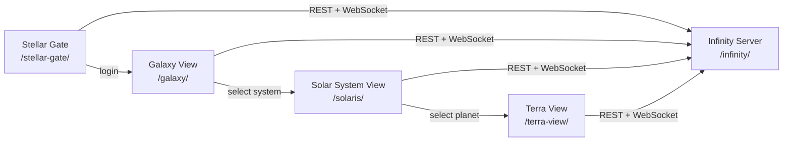

# AGENTS.md — Infinity (monorepo)

Guidance for AI coding agents working across the **Infinity** project.

**Canonical overview (user reference only):** [documentation/infinity.md](documentation/infinity.md) — do not read unless the user explicitly points to it.

---

## Project

**Infinity** is a **multiplayer open-world game** set in a dynamically generated galaxy. Players explore, colonize, and interact in real-time across procedurally generated star systems and planets — harvesting resources, crafting, and competing or collaborating with others.

| Field | Value |
|-------|-------|
| Author | Roro LeSage |
| Architecture | Monorepo — one backend, multiple independent web clients |
| API prefix | `/infinity` (REST + Socket.IO) |
| Local entry | `http://localhost/` or `http://infinity-dev.home.rh/` via [deployment/dev/caddy/Caddyfile](deployment/dev/caddy/Caddyfile) |

---

## Components

Six logical components; each maps to a sub-project directory when implemented.

| # | Component | Directory | Status | Role | Stack |
|---|-----------|-----------|--------|------|-------|
| 1 | **Infinity Server** | [`infinity/`](infinity/) | **Active** | Backend: players, real-time sync, procedural generation, persistence | NestJS 11, Socket.IO 4, PostgreSQL 16 (TypeORM), Mongoose 8, Redis 7 *(dev MongoDB: 4.4 — see [deployment/AGENTS.md](deployment/AGENTS.md))* |
| 2 | **Stellar Gate** | [`stellar-gate/`](stellar-gate/) | **Active** | Auth client: login, registration, forgot-password UI *(backend auth incomplete)* | React 18, TypeScript 5, Vite 5, React Router 6, Zustand 4, Axios, MUI 5 |
| 3 | **Cosmos Governance** | [`cosmos-governance/`](cosmos-governance/) | **Active** | Admin client: dedicated sign-in, server health, future ops dashboards *(backend auth incomplete)* | React 18, TypeScript 5, Vite 5, React Router 6, Zustand 4, Axios, MUI 5 |
| 4 | **Galaxy View** | `galaxy/` | Planned | 3D galaxy visualization; navigate and select star systems | TBD — see [documentation/architecture/3clients-analysis.md](documentation/architecture/3clients-analysis.md) |
| 5 | **Solar System View** (`solaris`) | [`solaris/`](solaris/) | **Active** | 2D star-system visualization: stars, planets, resources | React 18, TypeScript 5, Vite 5, PixiJS 7, Zustand 4, Axios |
| 6 | **Planetary View** (`terra-view`) | [`terra-view/`](terra-view/) | **Active** | 2D planetary surface: biomes, resources, challenges | React 18, TypeScript 5, Vite 5, PixiJS 7, Zustand 4, Axios |

After login, Stellar Gate redirects to `/galaxy` (full page navigation). Galaxy View is not in the repo yet — see [documentation/TO-BE-FIXED.md](documentation/TO-BE-FIXED.md) for known gaps (including the missing Caddy route for `/solaris/`).

---

## Repository layout

```
Infinity/                          # Monorepo root (this file)
├── .cursor/rules/                 # Cursor agent rules (monorepo scope)
├── rules/                         # Monorepo-wide conventions (documentation standards)
├── contracts/                     # OpenAPI, AsyncAPI, and JSON Schema contracts
│   ├── auth-api.yaml              # REST /auth/*
│   ├── admin-api.yaml             # REST /admin/*
│   ├── game-api.yaml              # REST health, players, galaxy, planets, resources
│   ├── openapi-shared.yaml        # Shared OpenAPI components
│   ├── asyncapi.yaml              # Socket.IO events
│   └── schemas/                   # JSON Schema DTOs and payloads
├── documentation/                 # Working directory — user-owned docs; agents do not read unless referenced
│   ├── infinity.md                # Canonical game + components overview
│   ├── architecture/              # High-level analysis (3 clients, server setup)
│   ├── server/                    # Server-domain specs mirrored from early planning
│   ├── stellar-gate/              # Stellar Gate setup guides
│   └── terra-view/                # Terra View setup guide
│
├── infinity/                      # Infinity Server (NestJS backend)
│   ├── src/                       # Application source
│   ├── test/                      # Unit + e2e tests
│   ├── scripts/                   # Server ops scripts
│   └── documentation/             # Working directory — agents do not read unless referenced
│
├── stellar-gate/                  # Authentication SPA
│   ├── src/                       # React app
│   └── documentation/             # Working directory — agents do not read unless referenced
│
├── cosmos-governance/             # Administration SPA
│   └── src/                       # React app
│
├── terra-view/                    # Planetary view client (React + PixiJS)
│   └── src/                       # React app
│
├── solaris/                       # Solar system view client (React + PixiJS)
│   └── src/                       # React app
│
├── galaxy/                        # Galaxy view client (planned — directory not created yet)
│
├── packages/                      # Shared npm workspace packages (see Shared packages section)
│   ├── shared-ui/                 # React components, hooks, theme — @infinity/shared-ui
│   ├── shared-types/              # TypeScript interfaces shared by all clients — @infinity/shared-types
│   ├── shared-utils/              # Pure utility functions — @infinity/shared-utils
│   └── shared-config/             # Constants, colors, settings — @infinity/shared-config
│
└── deployment/                    # Run scripts and config (dev only for now)
    ├── start-caddy.bat            # Start Caddy reverse proxy
    └── dev/                       # Local dev: Docker, Caddy config, helper scripts
        ├── docker/                # Compose (databases) + Dockerfile (server image)
        ├── caddy/                 # Caddyfile + Windows binary
        └── scripts/               # start-databases
```

### Directory roles

| Path | Scope | Notes |
|------|-------|-------|
| `documentation/` | Whole project | **Working directory** — do not read or search files here unless the user explicitly references a path (e.g. `@documentation/...`). Same rule applies to every sub-project `documentation/` folder. Use `contracts/` and source code for implementation context. |
| `contracts/` | Whole project | OpenAPI + AsyncAPI + JSON Schema — [contracts/](contracts/) · [auth-api.yaml](contracts/auth-api.yaml) · [admin-api.yaml](contracts/admin-api.yaml) · [game-api.yaml](contracts/game-api.yaml) · [asyncapi.yaml](contracts/asyncapi.yaml) · [schemas/](contracts/schemas/) |
| `infinity/` | Backend only | REST under `/infinity/*`, Socket.IO gateway, polyglot data layer. |
| `stellar-gate/` | Auth client only | Served at `/stellar-gate/`; dev port `3001`. |
| `cosmos-governance/` | Admin client only | Served at `/cosmos-governance/`; dev port `3002`. |
| `terra-view/` | Planet client only | Served at `/terra-view/`; dev port `3000`. |
| `solaris/` | Solar system client only | Served at `/solaris/`; dev port `3003` *(Caddy route not wired yet)*. |
| `galaxy/` | Galaxy client only | Planned; served at `/galaxy/`. |
| `packages/` | All clients | npm workspace packages — import as `@infinity/*`. Build each with `npm run build` inside the package directory. |
| `packages/shared-ui/` | All React clients | Presentation-only React components and hooks. React/React-DOM are peer dependencies — do not add them to `dependencies`. |
| `packages/shared-types/` | All clients + server | TypeScript interfaces for domain objects and events. No runtime dependencies. |
| `packages/shared-utils/` | All clients | Pure utility functions (formatters, math, random, helpers). No framework dependencies. |
| `packages/shared-config/` | All clients + server | Shared constants, color palette, timing values, z-index scale. No runtime dependencies. |
| `deployment/` | Run / ops (dev) | Scripts and config to start databases, reverse proxy, and (later) full stack. Production out of scope for now. |

---

## Local development

Use [deployment/dev/](deployment/dev/) to start shared infrastructure, then run each app in its own terminal. Run from the **monorepo root**.

| Step | Command | Port | URL path |
|------|---------|------|----------|
| 0. Server env *(first time)* | Copy `infinity/.env.example` → `infinity/.env` | — | — |
| 1. Databases | `deployment/dev/scripts/start-databases.ps1` (or `.sh`) | 5432, 27017, 6379 | — |
| 2. Infinity Server | `cd infinity && npm run start:dev` | 4000 | `/infinity/*` |
| 3. Stellar Gate | `cd stellar-gate && npm run dev` | 3001 | `/stellar-gate/` |
| 4. Cosmos Governance | `cd cosmos-governance && npm run dev` | 3002 | `/cosmos-governance/` |
| 5. Terra View | `cd terra-view && npm run dev` | 3000 | `/terra-view/` |
| 6. Solaris | `cd solaris && npm run dev` | 3003 | `/solaris/` |
| 7. Reverse proxy | `deployment/start-caddy.bat` | 80 | `/` → Stellar Gate |

Entry URL: `http://localhost/` or `http://infinity-dev.home.rh/`.

Details: [deployment/AGENTS.md](deployment/AGENTS.md) · [deployment/dev/README.md](deployment/dev/README.md) · known gaps: [documentation/TO-BE-FIXED.md](documentation/TO-BE-FIXED.md)

---

## Sub-project agent guides

When working inside a sub-project, read its dedicated `AGENTS.md` first — it contains commands, conventions, and constraints for that codebase.

| Sub-project | Agent guide |
|-------------|-------------|
| Shared packages | [packages/AGENTS.md](packages/AGENTS.md) |
| Deployment | [deployment/AGENTS.md](deployment/AGENTS.md) |
| Infinity Server | [infinity/AGENTS.md](infinity/AGENTS.md) |
| Stellar Gate | [stellar-gate/AGENTS.md](stellar-gate/AGENTS.md) |
| Cosmos Governance | [cosmos-governance/AGENTS.md](cosmos-governance/AGENTS.md) |
| Terra View | [terra-view/AGENTS.md](terra-view/AGENTS.md) · setup: [documentation/terra-view/terra-view-setup.md](documentation/terra-view/terra-view-setup.md) |
| Solaris | [solaris/AGENTS.md](solaris/AGENTS.md) |

---

## Documentation map

Index for human navigation and explicit user references — **not** for agent auto-discovery. Do not open these files unless the user cites one.

| Topic | Location |
|-------|----------|
| Game overview | [documentation/infinity.md](documentation/infinity.md) |
| Game rules (draft) | [contracts/game-rules.md](contracts/game-rules.md) |
| Terrain resources (draft) | [contracts/resources.md](contracts/resources.md) |
| Server API (source of truth) | [contracts/](contracts/) — OpenAPI, AsyncAPI, JSON Schemas |
| DTO schemas (JSON Schema) | [contracts/schemas/](contracts/schemas/) |
| OpenAPI (REST) | [contracts/auth-api.yaml](contracts/auth-api.yaml) · [admin-api.yaml](contracts/admin-api.yaml) · [game-api.yaml](contracts/game-api.yaml) |
| AsyncAPI (Socket.IO) | [contracts/asyncapi.yaml](contracts/asyncapi.yaml) |
| Local dev runbook | [deployment/dev/README.md](deployment/dev/README.md) |
| Deferred fixes (cross-project) | [documentation/TO-BE-FIXED.md](documentation/TO-BE-FIXED.md) |

**Language:** English is the primary language for code, agent guides, and new documentation. Several existing docs are in French. When you rely on or update a French doc, ask the user whether it should be translated to English.

Documentation conventions: [rules/documents.md](rules/documents.md). Code, paths, and API identifiers are always in English.

---

## Shared packages

All packages live under `packages/` and are managed as an **npm workspace** (root `package.json`). Each is built with `tsup` and imported under the `@infinity` scope.

Full details — exports, constraints, commands, tests, and adoption status — are in **[packages/AGENTS.md](packages/AGENTS.md)**.

---

## Agent workflow

1. **Identify scope** — backend (`infinity/`), a specific client, or run config (`deployment/`). Treat every `documentation/` directory (root and sub-project) as out of scope for reading unless the user explicitly references a file or asks you to edit docs there.
2. **Open the sub-project `AGENTS.md`** when editing code under that directory.
3. **Keep changes minimal** — match existing patterns in the touched sub-project; do not refactor across repos unless asked.
4. **Do not read `documentation/` proactively** — no browsing, searching, or following links into any `documentation/` directory (root, sub-project, or cross-project) unless the user gives an explicit path (e.g. `@documentation/infinity.md`, `@infinity/documentation/objects/cube.md`). Links elsewhere in this file are pointers for the user, not permission to read.
5. **Do not create git commits** unless the user explicitly requests it.
6. **Do not commit secrets** — `.env`, credentials, JWT secrets.
7. **Do not create new documentation files** unless the user explicitly asks.

---

## Client flow (target)



Implementation status and deferred work: [documentation/TO-BE-FIXED.md](documentation/TO-BE-FIXED.md).
