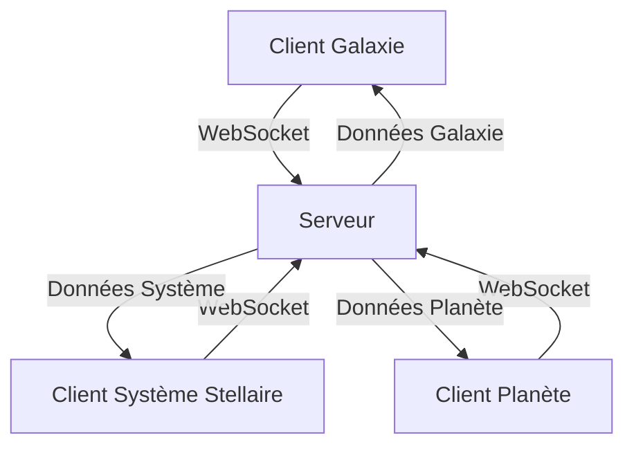
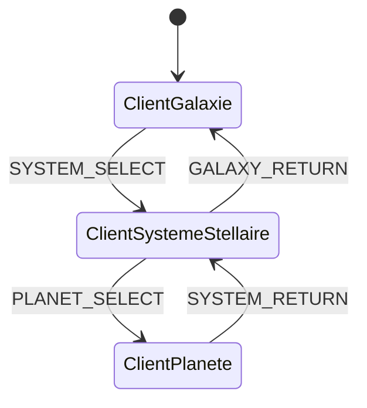

# Infinity - Analyse Affinée des 3 Clients

**Date** : 7 juin 2026  
**Modèle** : Vibe (Mistral Medium 3.5)  
**Auteur** : Roro LeSage

---

## **1. Introduction**

Ce document affine l'analyse technique pour les **3 clients distincts** du jeu **Infinity** :

1. **Client Galaxie** (3D) : Vue globale de la galaxie.
2. **Client Système Stellaire** (2D) : Vue d'un système stellaire.
3. **Client Planète** (2D) : Vue détaillée d'une planète.

&nbsp;

---




- Les **3 clients communiquent avec le même serveur** via WebSocket.
- Chaque client est une **application web indépendante** (ou une seule application avec des vues dynamiques).
- Le serveur gère la **synchronisation** entre les clients et les données du monde.

---


- Afficher une **vue 3D de la galaxie** avec les systèmes stellaires comme des points lumineux.
- Permettre la **navigation** entre les systèmes stellaires.
- Afficher les **positions des autres joueurs** (si visibles à cette échelle).


| &nbsp; | &nbsp; |
| ------ | ------ |
| &nbsp; | &nbsp; |
| &nbsp; | &nbsp; |
| &nbsp; | &nbsp; |
| &nbsp; | &nbsp; |
| &nbsp; | &nbsp; |
| &nbsp; | &nbsp; |


| &nbsp; | &nbsp; | &nbsp; |
| ------ | ------ | ------ |
| &nbsp; | &nbsp; | &nbsp; |
| &nbsp; | &nbsp; | &nbsp; |
| &nbsp; | &nbsp; | &nbsp; |
| &nbsp; | &nbsp; | &nbsp; |
| &nbsp; | &nbsp; | &nbsp; |
| &nbsp; | &nbsp; | &nbsp; |
| &nbsp; | &nbsp; | &nbsp; |


- **Instanced Rendering** : Pour afficher des milliers d'étoiles/systèmes avec un minimum de draw calls.
- **Frustum Culling** : Ne rendre que les objets visibles dans le champ de vision de la caméra.
- **Lazy Loading** : Charger les modèles 3D des systèmes stellaires uniquement lorsqu'ils sont proches.
- **Web Workers** : Pour les calculs lourds (ex: génération de positions d'étoiles).


```javascript
// Initialisation de la scène 3D
const scene = new THREE.Scene();
const camera = new THREE.PerspectiveCamera(75, window.innerWidth / window.innerHeight, 0.1, 10000);
const renderer = new THREE.WebGLRenderer({ antialias: true });

// Ajout d'un système stellaire (exemple)
const starGeometry = new THREE.SphereGeometry(0.5, 32, 32);
const starMaterial = new THREE.MeshBasicMaterial({ color: 0xFFFF00 });
const star = new THREE.Mesh(starGeometry, starMaterial);
star.position.set(10, 5, -15);
scene.add(star);

// Contrôles de caméra
const controls = new THREE.OrbitControls(camera, renderer.domElement);
controls.enableDamping = true;

// Animation
function animate() {
    requestAnimationFrame(animate);
    controls.update();
    renderer.render(scene, camera);
}
animate();
```

---


- Afficher une **vue 2D d'un système stellaire** (étoiles, planètes, astéroïdes).
- Permettre la **navigation entre les planètes** du système.
- Afficher les **orbites** et les **mouvements des objets célestes**.
- Gérer les **interactions** (sélection de planète, affichage d'infos).


| &nbsp; | &nbsp; |
| ------ | ------ |
| &nbsp; | &nbsp; |
| &nbsp; | &nbsp; |
| &nbsp; | &nbsp; |
| &nbsp; | &nbsp; |
| &nbsp; | &nbsp; |
| &nbsp; | &nbsp; |


| &nbsp; | &nbsp; | &nbsp; |
| ------ | ------ | ------ |
| &nbsp; | &nbsp; | &nbsp; |
| &nbsp; | &nbsp; | &nbsp; |
| &nbsp; | &nbsp; | &nbsp; |
| &nbsp; | &nbsp; | &nbsp; |
| &nbsp; | &nbsp; | &nbsp; |
| &nbsp; | &nbsp; | &nbsp; |


- **Sprite Batching** : Regrouper les sprites pour réduire les draw calls.
- **QuadTree** : Pour optimiser la détection des collisions.
- **Lazy Loading** : Charger les sprites des planètes uniquement lorsqu'elles sont visibles.
- **Web Workers** : Pour les calculs d'orbites complexes.


```javascript
// Initialisation de PixiJS
const app = new PIXI.Application({ width: 800, height: 600 });
document.body.appendChild(app.view);

// Ajout d'une étoile
const star = new PIXI.Sprite(PIXI.Texture.from('star.png'));
star.anchor.set(0.5);
star.position.set(400, 300);
app.stage.addChild(star);

// Ajout d'une planète
const planet = new PIXI.Sprite(PIXI.Texture.from('planet.png'));
planet.anchor.set(0.5);
planet.position.set(450, 300);
app.stage.addChild(planet);

// Animation simple (orbite)
app.ticker.add(() => {
    const angle = app.ticker.lastTime * 0.001;
    planet.position.x = 400 + Math.cos(angle) * 100;
    planet.position.y = 300 + Math.sin(angle) * 100;
});
```

---


- Afficher une **vue 2D détaillée d'une planète** (carte, ressources, bâtiments).
- Permettre la **récolte de ressources**, la **construction** et les **interactions** avec l'environnement.
- Gérer les **mouvements du joueur** sur la planète.
- Afficher les **autres joueurs** et leurs actions.


| &nbsp; | &nbsp; |
| ------ | ------ |
| &nbsp; | &nbsp; |
| &nbsp; | &nbsp; |
| &nbsp; | &nbsp; |
| &nbsp; | &nbsp; |
| &nbsp; | &nbsp; |
| &nbsp; | &nbsp; |
| &nbsp; | &nbsp; |


| &nbsp; | &nbsp; | &nbsp; |
| ------ | ------ | ------ |
| &nbsp; | &nbsp; | &nbsp; |
| &nbsp; | &nbsp; | &nbsp; |
| &nbsp; | &nbsp; | &nbsp; |
| &nbsp; | &nbsp; | &nbsp; |
| &nbsp; | &nbsp; | &nbsp; |
| &nbsp; | &nbsp; | &nbsp; |


- **Tilemap Rendering** : Utiliser des tilesets pour optimiser le rendu de la carte.
- **Chunking** : Diviser la carte en chunks pour ne charger que les parties visibles.
- **Object Pooling** : Réutiliser les objets (ex: sprites de ressources) pour éviter les allocations mémoire.
- **Web Workers** : Pour la génération procédurale de la carte.


```javascript
// Initialisation de PixiJS
const app = new PIXI.Application({ width: 800, height: 600 });
document.body.appendChild(app.view);

// Chargement d'un tileset
PIXI.Assets.load('tileset.json').then(() => {
    const tileset = PIXI.BaseTexture.from('tileset.png');
    
    // Création d'une carte simple
    for (let y = 0; y < 10; y++) {
        for (let x = 0; x < 10; x++) {
            const tile = new PIXI.Sprite(tileset);
            tile.position.set(x * 32, y * 32);
            app.stage.addChild(tile);
        }
    }
});

// Ajout d'un joueur
const player = new PIXI.Sprite(PIXI.Texture.from('player.png'));
player.position.set(200, 200);
app.stage.addChild(player);

// Déplacement du joueur (exemple)
window.addEventListener('keydown', (e) => {
    if (e.key === 'ArrowRight') player.position.x += 5;
    if (e.key === 'ArrowLeft') player.position.x -= 5;
    if (e.key === 'ArrowUp') player.position.y -= 5;
    if (e.key === 'ArrowDown') player.position.y += 5;
});
```

---


- **WebSocket** (via Socket.IO) pour une communication **bidirectionnelle et temps réel**.
- Chaque client envoie et reçoit des **messages typés** (ex: `GALAXY_MOVE`, `SYSTEM_SELECT`, `PLANET_LAND`).


| &nbsp; | &nbsp; | &nbsp; |
| ------ | ------ | ------ |
| &nbsp; | &nbsp; | &nbsp; |
| &nbsp; | &nbsp; | &nbsp; |
| &nbsp; | &nbsp; | &nbsp; |


| &nbsp; | &nbsp; | &nbsp; |
| ------ | ------ | ------ |
| &nbsp; | &nbsp; | &nbsp; |
| &nbsp; | &nbsp; | &nbsp; |


| &nbsp; | &nbsp; | &nbsp; |
| ------ | ------ | ------ |
| &nbsp; | &nbsp; | &nbsp; |
| &nbsp; | &nbsp; | &nbsp; |


| &nbsp; | &nbsp; | &nbsp; |
| ------ | ------ | ------ |
| &nbsp; | &nbsp; | &nbsp; |


| &nbsp; | &nbsp; | &nbsp; |
| ------ | ------ | ------ |
| &nbsp; | &nbsp; | &nbsp; |
| &nbsp; | &nbsp; | &nbsp; |
| &nbsp; | &nbsp; | &nbsp; |


| &nbsp; | &nbsp; | &nbsp; |
| ------ | ------ | ------ |
| &nbsp; | &nbsp; | &nbsp; |
| &nbsp; | &nbsp; | &nbsp; |


---


1. **Galaxie → Système Stellaire** :
  - Le joueur clique sur un système stellaire dans le **Client Galaxie**. 
  - Le **Client Galaxie** envoie un message `SYSTEM_SELECT` au serveur.
  - Le serveur valide la requête et envoie les données du système au **Client Système Stellaire**. 
  - Le **Client Système Stellaire** s'ouvre et affiche le système.
2. **Système Stellaire → Planète** :
  - Le joueur clique sur une planète dans le **Client Système Stellaire**. 
  - Le **Client Système Stellaire** envoie un message `PLANET_SELECT` au serveur.
  - Le serveur valide la requête et envoie les données de la planète au **Client Planète**. 
  - Le **Client Planète** s'ouvre et affiche la carte de la planète.
3. **Planète → Système Stellaire** :
  - Le joueur appuie sur un bouton "Retour au système" dans le **Client Planète**. 
  - Le **Client Planète** envoie un message `SYSTEM_RETURN` au serveur.
  - Le serveur renvoie les données du système au **Client Système Stellaire**.
4. **Système Stellaire → Galaxie** :
  - Le joueur appuie sur un bouton "Retour à la galaxie" dans le **Client Système Stellaire**. 
  - Le **Client Système Stellaire** envoie un message `GALAXY_RETURN` au serveur.
  - Le serveur renvoie les données de la galaxie au **Client Galaxie**.




---


- **Cache** :
  - Liste des systèmes stellaires **visités** (coordonnées, ID, statut).
  - Positions des **derniers systèmes sélectionnés**.


- **Cache** :
  - Données des **systèmes stellaires visités** (étoiles, planètes, orbites).
  - Positions des **planètes déjà explorées**.


- **Cache** :
  - **Cartes des planètes visitées** (tiles, ressources, structures).
  - **Seed** de génération procédurale pour chaque planète.

---


| &nbsp; | &nbsp; | &nbsp; | &nbsp; | &nbsp; |
| ------ | ------ | ------ | ------ | ------ |
| &nbsp; | &nbsp; | &nbsp; | &nbsp; | &nbsp; |
| &nbsp; | &nbsp; | &nbsp; | &nbsp; | &nbsp; |
| &nbsp; | &nbsp; | &nbsp; | &nbsp; | &nbsp; |
| &nbsp; | &nbsp; | &nbsp; | &nbsp; | &nbsp; |
| &nbsp; | &nbsp; | &nbsp; | &nbsp; | &nbsp; |
| &nbsp; | &nbsp; | &nbsp; | &nbsp; | &nbsp; |
| &nbsp; | &nbsp; | &nbsp; | &nbsp; | &nbsp; |


---


1. **Prototype de base** :
  - Rendu 3D d'une galaxie statique avec Three.js.
  - Navigation libre (zoom, rotation).
2. **Ajout des systèmes stellaires** :
  - Affichage des systèmes comme des points lumineux.
  - Sélection d'un système pour basculer vers le Client Système Stellaire.
3. **Optimisations** :
  - Instanced Rendering pour les étoiles.
  - Lazy Loading des modèles 3D.
4. **Synchronisation** :
  - Connexion WebSocket avec le serveur.
  - Affichage des autres joueurs.


1. **Prototype de base** :
  - Rendu 2D d'un système stellaire avec PixiJS.
  - Affichage d'une étoile et de planètes en orbite.
2. **Ajout des interactions** :
  - Sélection d'une planète pour basculer vers le Client Planète.
  - Déplacement du joueur dans le système.
3. **Optimisations** :
  - Sprite Batching pour les objets célestes.
  - QuadTree pour les collisions.
4. **Synchronisation** :
  - Réception des positions des autres joueurs.


1. **Prototype de base** :
  - Rendu 2D d'une carte de planète avec PixiJS/Phaser.
  - Génération procédurale de la carte (Perlin Noise).
2. **Ajout des interactions** :
  - Déplacement du joueur sur la carte.
  - Récolte de ressources.
  - Construction de bâtiments.
3. **Optimisations** :
  - Chunking pour la carte.
  - Object Pooling pour les ressources.
4. **Synchronisation** :
  - Réception des actions des autres joueurs.

---


- **Données partagées** : Les 3 clients doivent utiliser les **mêmes données** pour un système/planète (ex: seed de génération procédurale).
- **Synchronisation** : Le serveur doit garantir que les actions dans un client sont **répercutées** dans les autres (ex: un joueur qui récolte une ressource sur une planète doit voir cette action dans le Client Planète et le Client Système Stellaire).


- **Client Galaxie** : Optimiser le rendu de milliers d'objets 3D.
- **Client Système Stellaire** : Gérer les orbites et collisions en temps réel.
- **Client Planète** : Charger dynamiquement les chunks de la carte.


- **Transitions fluides** : Assurer des transitions sans saccades entre les clients.
- **Temps de chargement** : Minimiser les temps de chargement entre les vues (ex: précharger les données du système stellaire avant la bascule).

---


- **Versioning** : Git (GitHub/GitLab).
- **CI/CD** : GitHub Actions ou GitLab CI.
- **Monitoring** : Prometheus + Grafana (pour le serveur).
- **Debugging** : Chrome DevTools (clients), VS Code Debugger (serveur).