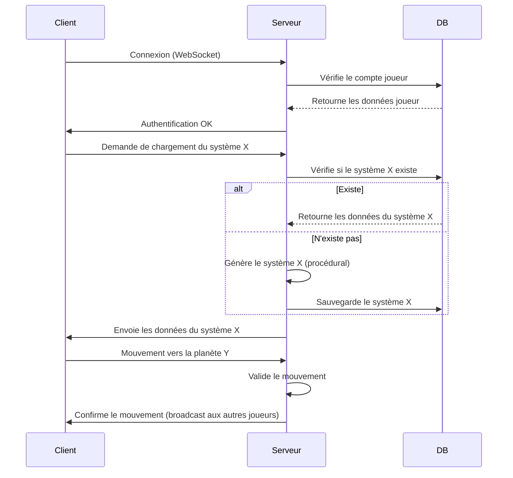

# Infinity - Analyse d'Architecture Technique

**Date** : 7 juin 2026  
**Modèle** : Vibe (Mistral Medium 3.5)  
**Auteur** : Roro LeSage

---

## **1. Introduction**

Ce document présente une analyse technique pour la conception du jeu **Infinity**, un jeu multijoueur en monde ouvert, se déroulant dans une galaxie générée dynamiquement. Le jeu sera accessible via un client léger (technologie web) et offrira une expérience en temps réel, avec des systèmes stellaires en 2D et une navigation en 3D dans la galaxie.

---

## **2. Architecture Globale**

Le jeu est découpé en **3 couches principales** :

### **A. Client (Frontend)**

- **Rôle** : Affichage, interactions utilisateur, gestion des inputs, rendu graphique.
- **Technologies** :
  - **Framework** : [Three.js](https://threejs.org/) (rendu 3D de la galaxie) + [PixiJS](https://pixijs.com/) ou [Phaser](https://phaser.io/) (systèmes stellaires en 2D).
  - **UI** : React (avec [Zustand](https://github.com/pmndrs/zustand) ou Redux) ou Vue.js.
  - **Communication** : WebSocket (temps réel) via [Socket.IO](https://socket.io/).
  - **Stockage local** : IndexedDB (cache des systèmes/planètes déjà visités).
  - **Gestion des assets** : Chargement dynamique des textures/modèles 3D (GLTF/GLB) via [GLTFLoader](https://threejs.org/docs/#manual/en/introduction/Loading-3D-models).

### **B. Serveur (Backend)**

- **Rôle** : Gestion des joueurs, synchronisation, génération procédurale, persistance des données.
- **Technologies** :
  - **Langage** : Node.js (TypeScript) ou Go.
  - **Framework** : NestJS ou Fastify.
  - **Base de données** :
    - **Primary DB** : PostgreSQL (données structurées : comptes joueurs, inventaires, etc.).
    - **Cache/Session** : Redis (données temporaires : positions des joueurs en temps réel).
    - **Stockage des mondes** : MongoDB (données non structurées : systèmes/planètes générés dynamiquement).
  - **Génération procédurale** : Algorithmes côté serveur (ou worker dédié).
  - **Communication temps réel** : Socket.IO ou [uWebSockets](https://github.com/uNetworking/uWebSockets).
  - **Orchestration** : Kubernetes ou Docker Swarm.

### **C. Workers (Optionnel pour le scaling)**

- **Rôle** : Décharger le serveur principal des tâches lourdes (génération procédurale, calculs physiques, etc.).
- **Technologies** :
  - **Queue de tâches** : BullMQ (Redis-based) ou RabbitMQ.
  - **Workers** : Node.js ou Rust (pour les calculs intensifs).

---

## **3. Découpage des Composants Clés**

### **A. Génération Procédurale**

- **Galaxie** :
  - Générée via un algorithme de **noise 3D** (ex: [Perlin Noise](https://adrianb.io/2014/08/09/perlinnoise.html)) pour placer les systèmes stellaires.
  - Coordonnées stockées en **3D** (x, y, z) dans MongoDB.
- **Systèmes Stellaires** :
  - Générés en **2D** (coordonnées x, y) avec des règles de physique simplifiées (gravité, orbites).
  - Chaque système contient :
    - 1+ étoiles (type, taille, température).
    - N planètes (type, ressources, atmosphère, etc.).
  - **Stockage** : Uniquement les systèmes/planètes **visités** sont sauvegardés en DB.
- **Planètes** :
  - Carte générée via **noise 2D** (biomes, montagnes, océans).
  - Ressources aléatoires (métaux, gaz, minéraux) avec un système de **seed** pour la reproductibilité.
  - **Optimisation** : Les données des planètes non visitées ne sont **pas calculées** côté serveur.

### **B. Synchronisation Multijoueur**

- **Position des joueurs** :
  - Envoyée en temps réel via WebSocket (ex: toutes les 100ms).
  - Le serveur valide les mouvements (anti-cheat, collisions).
- **État du monde** :
  - Seuls les **systèmes/planètes actifs** (avec des joueurs) sont chargés en mémoire.
  - Utilisation d’un **système de chunks** (comme Minecraft) pour limiter la charge serveur.
- **Événements** :
  - Actions des joueurs (récolte, combat, construction) sont diffusées aux autres joueurs du même système/planète.

### **C. Rendu et Optimisation Client**

- **Galaxie (3D)** :
  - Rendu avec **Three.js** + shaders personnalisés pour les étoiles/nébuleuses.
  - **LOD (Level of Detail)** : Les systèmes lointains sont rendus comme des points lumineux, les proches en 2D.
- **Systèmes Stellaires (2D)** :
  - Rendu avec **PixiJS** ou **Phaser** (meilleure performance pour le 2D).
  - **Camera follow** : Centrée sur le joueur, avec un système de zoom.
- **Planètes** :
  - Carte générée côté client via **noise** (seed partagée par le serveur).
  - **Textures dynamiques** : Chargement à la volée des tiles de la carte.

### **D. Persistance des Données**

- **Joueurs** :
  - Comptes, inventaires, stats → **PostgreSQL**.
- **Monde** :
  - Systèmes/planètes visités → **MongoDB** (documents JSON flexibles).
  - Cache des positions joueurs → **Redis**.

---

## **4. Stack Technologique Recommandée**

| **Couche**          | **Technologie**              | **Rôle**                             |
| ------------------- | ---------------------------- | ------------------------------------ |
| **Client**          | Three.js + PixiJS + React    | Rendu 3D/2D, UI, gestion des inputs  |
| **Communication**   | Socket.IO                    | Temps réel (WebSocket)               |
| **Serveur**         | NestJS (Node.js/TypeScript)  | API REST + WebSocket, logique métier |
| **Base de données** | PostgreSQL + MongoDB + Redis | Données structurées, monde, cache    |
| **Génération**      | Algorithmes custom (Noise)   | Génération procédurale côté serveur  |
| **Déploiement**     | Docker + Kubernetes          | Conteneurisation et scaling          |

---

## **5. Points d’Attention et Optimisations**

### **A. Performance**

- **Client** :
  - Utiliser **WebGL2** pour le rendu 3D.
  - **Lazy loading** des assets (textures, modèles 3D).
  - **Web Workers** pour les calculs lourds (génération de noise).
- **Serveur** :
  - **Chunking** : Ne charger que les systèmes/planètes actifs.
  - **Rate limiting** pour éviter les abus (ex: génération massive de planètes).
  - **Workers** pour la génération procédurale.

### **B. Synchronisation**

- **Interpolation** : Pour fluidifier les mouvements des autres joueurs.
- **Prédiction côté client** : Réduire la latence perçue.
- **Reconciliation** : Le serveur valide les actions et corrige si nécessaire.

### **C. Sécurité**

- **Anti-cheat** :
  - Vérification côté serveur des mouvements/actions.
  - Détection des **speed hacks** (ex: joueur se téléportant).
- **Authentification** : JWT + OAuth2 (ex: Discord/Google login).

### **D. Scalabilité**

- **Horizontal scaling** : Ajouter des instances serveur si nécessaire.
- **Sharding** : Répartir les joueurs sur différents serveurs (ex: par région de la galaxie).

---

## **6. Exemple de Flux de Données**

---

## **7. Roadmap de Développement**

1. **Prototype Client** :
  - Rendu 3D de base avec Three.js (galaxie statique).
  - Navigation entre systèmes en 2D (PixiJS).
2. **Prototype Serveur** :
  - Génération procédurale d’un système stellaire.
  - Synchronisation basique via WebSocket.
3. **Intégration** :
  - Connexion client/serveur.
  - Persistance des données (MongoDB).
4. **Optimisations** :
  - Chargement dynamique des assets.
  - Chunking côté serveur.
5. **Features Avancées** :
  - Combat, récolte, craft.
  - Système de factions/économie.

---

- **Versioning** : Git (GitHub/GitLab).
- **CI/CD** : GitHub Actions ou GitLab CI.
- **Monitoring** : Prometheus + Grafana (pour le serveur).
- **Debugging** : Chrome DevTools (client), VS Code Debugger (serveur).

