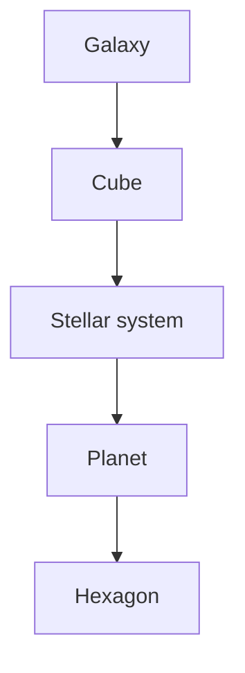

# Location

```yaml
date: 2026-06-21
author: Roro LeSage
model: Composer
sources:
  - contracts/game-rules.md
  - contracts/game-api.yaml
  - contracts/schemas/shared/player-location.json
  - contracts/schemas/shared/cube-location.json
  - contracts/schemas/shared/star-system-location.json
  - contracts/schemas/shared/planet-location.json
  - infinity/src/shared/interfaces/player-location.interface.ts
  - infinity/src/shared/utils/player-location.ts
  - documentation/units/units.md
modified:
  - date: 2026-06-21
    author: Roro LeSage
    note: Split player vs unit location; define coordinates per place
  - date: 2026-06-21
    author: Roro LeSage
    note: Player on planet without hex
  - date: 2026-06-21
    author: Roro LeSage
    note: Unified Location type with subject-specific validation
```

## Overview

A **location** is where something exists in the Infinity galaxy.

Infinity is a **god game**: the player commands units and infrastructure rather than walking the map. **Players** and **units** share the **same location data structure** (`Location`). What differs is not the shape, but **which fields are required or forbidden** for each subject — enforced by a **validation profile** (`player` or `unit`).

| Alias | Used by | `location` value |
| ----- | ------- | ---------------- |
| `PlayerLocation` | Player presence (view / command focus) | `Location` or `null` (freshy before spawn) |
| `UnitLocation` | Units and infrastructure | `Location` (required once placed) |

Both aliases refer to the same type: `type PlayerLocation = Location; type UnitLocation = Location;`

---

## Places

A player or unit can only be in one of these places:

| Place | Description | Client view |
| ----- | ----------- | ----------- |
| **Cube** | A 10 LY × 10 LY × 10 LY section of the galaxy | Galaxy View *(planned)* |
| **Stellar system** | A star and its orbiting planets | Solaris |
| **Planet** | A landable world in a stellar system | *(context when entering Terra View)* |
| **Hexagon** | One cell on a planet’s toroidal hex surface | Terra View |

Places nest: a hex belongs to a planet, which belongs to a stellar system, which belongs to a cube.



**Invariant:** parent levels provide **identity** (`id`); the deepest level provides **position**. Parent coordinate fields are omitted once presence moves deeper (e.g. at hex depth, there is no `starSystem.position` or `cube.position`).

---

## Location structure

One object shape at every depth. Optional fields at planet depth depend on how deep presence goes on the surface.

### Fields

| Field | Type | Present at depth | Description |
| ----- | ---- | ---------------- | ----------- |
| `cube.id` | string | all | Parent cube identity. Always required. |
| `cube.position` | `Vec3Local` | `cube` | 3D position in the cube — `[0, 10)` LY per axis. |
| `starSystem.id` | string | `starSystem`, `planet` | Parent stellar system identity. |
| `starSystem.position` | `Vec2Local` | `starSystem` | 2D position on the system map. |
| `planet.id` | string | `planet` | Planet identity. |
| `planet.hex_coords` | `HexCoords` | hex *(optional at `planet` for players)* | Axial `{ q, r }` on the toroidal hex surface. |
| `planet.position` | `Vec2Local` | in-hex *(units only)* | 2D position **within** the hex cell. |

### Coordinates by place

| Place | Fields used |
| ----- | ----------- |
| **Cube** | `cube.position` (`Vec3Local`) |
| **Stellar system** | `starSystem.position` (`Vec2Local`) |
| **Planet** | `planet.id` only — no `hex_coords`, no `planet.position` |
| **Hexagon** | `planet.id` + `planet.hex_coords`; optionally `planet.position` for units |

On a planet, a player may be **on the planet** without a hex (planet overview). Selecting a hex adds `hex_coords`. Units on a planet **always** have `hex_coords` and `planet.position`.

### Depth variants

Depth is inferred from which nested objects include coordinates:

| Depth | Places covered | Active coordinate fields |
| ----- | -------------- | ------------------------ |
| `cube` | Cube | `cube.position` |
| `starSystem` | Stellar system | `starSystem.position` |
| `planet` | Planet only | `planet.id` |
| `planet` | Planet + hex | `planet.id` + `planet.hex_coords` |
| `planet` | Planet + hex + in-hex | above + `planet.position` *(units only)* |

---

## Examples

**Cube**

```json
{
  "cube": {
    "id": "550e8400-e29b-41d4-a716-446655440000",
    "position": { "x": 3.5, "y": 7.2, "z": 1.0 }
  }
}
```

**Stellar system**

```json
{
  "cube": { "id": "550e8400-e29b-41d4-a716-446655440000" },
  "starSystem": {
    "id": "6ba7b810-9dad-11d1-80b4-00c04fd430c8",
    "position": { "x": 120.5, "y": 340.0 }
  }
}
```

**Planet (no hex)** — valid for `player` profile only

```json
{
  "cube": { "id": "550e8400-e29b-41d4-a716-446655440000" },
  "starSystem": { "id": "6ba7b810-9dad-11d1-80b4-00c04fd430c8" },
  "planet": {
    "id": "6ba7b811-9dad-11d1-80b4-00c04fd430c8"
  }
}
```

**Planet + hex** — valid for `player` profile; also valid for `unit` profile when `planet.position` is added

```json
{
  "cube": { "id": "550e8400-e29b-41d4-a716-446655440000" },
  "starSystem": { "id": "6ba7b810-9dad-11d1-80b4-00c04fd430c8" },
  "planet": {
    "id": "6ba7b811-9dad-11d1-80b4-00c04fd430c8",
    "hex_coords": { "q": 12, "r": 7 }
  }
}
```

**Planet + hex + in-hex position** — valid for `unit` profile only

```json
{
  "cube": { "id": "550e8400-e29b-41d4-a716-446655440000" },
  "starSystem": { "id": "6ba7b810-9dad-11d1-80b4-00c04fd430c8" },
  "planet": {
    "id": "6ba7b811-9dad-11d1-80b4-00c04fd430c8",
    "hex_coords": { "q": 12, "r": 7 },
    "position": { "x": 0.35, "y": 0.72 }
  }
}
```

The range and semantics of `planet.position` within a hex **to be defined** (e.g. normalized `[0, 1)` coordinates or map units).

---

## Validation profiles

One validator, two profiles. Target API:

```typescript
assertValidLocation(location, { subject: 'player' });
assertValidLocation(location, { subject: 'unit' });
```

### Shared rules (both profiles)

| Rule | Detail |
| ---- | ------ |
| Single coordinate level | Position fields appear only at the deepest present depth. |
| Required parents | `starSystem` required when `planet` is present; `cube.id` always required. |
| Cube local bounds | `cube.position` ∈ `[0, 10)` per axis. |
| Hex integers | When present, `hex_coords.q` and `hex_coords.r` are non-negative integers. |
| No mixed depths | e.g. `planet` + `starSystem.position` is invalid. |

### Profile: `player`

The player’s **presence** is where they are active now (see [game-rules.md](../contracts/game-rules.md) → Glossary).

| Rule | Detail |
| ---- | ------ |
| Planet without hex | Allowed — `planet.id` only, `hex_coords` omitted. **(planned)** |
| Hex optional | `hex_coords` may be present at planet depth; never required for overview. |
| No in-hex position | `planet.position` must be **absent**. |
| Null | `location: null` allowed before first spawn (freshy). **(implemented)** |

### Profile: `unit`

Every unit and piece of infrastructure has a required `location` once placed. See [units/units.md](units/units.md).

| Rule | Detail |
| ---- | ------ |
| Planet without hex | **Not allowed** — units must always be on a hex at planet depth. |
| Hex required | `hex_coords` required whenever `planet` is present. |
| In-hex position required | `planet.position` required alongside `hex_coords`. |
| In-hex bounds | Range **to be defined**. |
| Null | **Not allowed** once placed. |

### Profile comparison

| Aspect | `player` | `unit` |
| ------ | -------- | ------ |
| Purpose | Camera / command focus | Map placement |
| Cube / system | Same shape and rules | Same shape and rules |
| Planet without hex | Allowed | Not allowed |
| `hex_coords` | Optional | Required on planet |
| `planet.position` | Forbidden | Required with hex |
| `location: null` | Allowed (freshy) | Not allowed |

A player on a hex is a unit location **with `planet.position` omitted**. Focusing the camera on a unit can copy the unit’s `Location` and drop `planet.position`.

---

## Usage

The same `Location` type is stored and transmitted in different contexts:

| Context | Field | Profile | Status |
| ------- | ----- | ------- | ------ |
| Player record | `player.location` | `player` | **Partially implemented** |
| Unit record | `unit.location` | `unit` | **Planned** |
| Infrastructure record | `infrastructure.location` | `unit` *(same rules as units)* | **Planned** |

Storage, API routes, and transitions remain **separate per entity** even though the location shape is shared.

### Transitions

Depth transitions use the same `Location` structure for players and units:

| Transition | From → to | Sets |
| ---------- | --------- | ---- |
| `enterStarSystem` | cube → starSystem | `starSystemId`, `position` (Vec2) |
| `enterPlanet` | starSystem → planet *(no hex)* | `planetId` — `hex_coords` omitted |
| `selectHex` | planet → planet + hex | `hex_coords` |
| `leavePlanet` | planet → starSystem | `position` (Vec2) |
| `leaveStarSystem` | starSystem → cube | `position` (Vec3) |

`enterPlanet` with `hex_coords` (planet + hex in one step) remains valid for spawn and direct landings. **`selectHex`** is **planned** as a separate transition or PATCH on `planet.hex_coords`.

Unit cross-place movement (cube ↔ system ↔ planet) is **planned**; see [game-rules.md](../contracts/game-rules.md).

---

## Implementation status

| Item | Status | Notes |
| ---- | ------ | ----- |
| Unified `Location` type | **Planned** | Code still uses `PlayerLocation` name today |
| Shared depth invariants | **Partially implemented** | [player-location.ts](../infinity/src/shared/utils/player-location.ts) |
| `player` profile — cube, system | **Implemented** | |
| `player` profile — planet + hex | **Implemented** | First spawn always assigns a hex today |
| `player` profile — planet without hex | **Planned** | Server currently requires `hex_coords` |
| `player` profile — reject `planet.position` | **Planned** | Field not in current schema |
| `unit` profile | **Planned** | |
| Subject parameter on validator | **Planned** | `assertValidLocation(loc, { subject })` |

### Source of truth (today)

Player location is implemented under the legacy name `PlayerLocation`. Target consolidation:

- TypeScript: generalize [player-location.interface.ts](../infinity/src/shared/interfaces/player-location.interface.ts) → `Location` *(keep `PlayerLocation` as alias)*
- JSON Schema: extend [planet-location.json](../contracts/schemas/shared/planet-location.json) with optional `hex_coords` and `position`; unify under `location.json`
- Validation: extend [player-location.ts](../infinity/src/shared/utils/player-location.ts) with `{ subject: 'player' | 'unit' }`
- API: [game-api.yaml](../contracts/game-api.yaml) — `/infinity/players/me/location` and future unit routes

---

## Related documents

- [game-rules.md](../contracts/game-rules.md) — god-game rules, player presence, unit movement
- [game-api.yaml](../contracts/game-api.yaml) — REST routes for player location
- [units/units.md](units/units.md) — unit fields including `location`
- [infinity/documentation/objects/cube.md](../infinity/documentation/objects/cube.md) — cube identity and local coordinates
- [infinity/documentation/objects/star-system.md](../infinity/documentation/objects/star-system.md) — stellar system as a place
- [infinity/documentation/objects/planet.md](../infinity/documentation/objects/planet.md) — planetary hex surface
