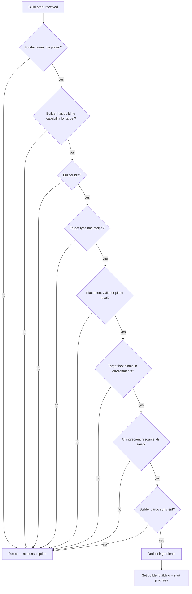

# Building — Base Specification

```yaml
date: 2026-06-30
author: Roro LeSage
model: Composer
sources:
  - contracts/game-rules.md
  - contracts/resources.md
  - infinity/src/shared/interfaces/unit-type.interface.ts
  - infinity/src/modules/units/constants/unit-catalog.ts
  - infinity/src/modules/units/unit-extraction.service.ts
  - infinity/src/modules/units/unit-cargo.service.ts
  - packages/shared-config/src/constants.ts
  - packages/shared-config/src/terrain-resources.ts
```

Work-in-progress specification for **in-game unit construction**. Describes catalog data, validation rules, resource payment, build timing, and builder state. **Not yet implemented** in the Infinity Server or clients.

---

## Overview

Players command **builder units** (units with a `building` capability) to construct other unit types. Each buildable unit type defines a **recipe**: resource ingredients and a **work** value that controls duration. The server is authoritative; clients (Terra View, Solaris, …) send build intentions including the **target placement** chosen by the player.

A unit type **without a recipe cannot be built** through this system. Direct instance creation outside this flow (for example initial spawn on `enter-game`) is a separate server path and is not covered here.

---

## Recipe (unit type catalog)

### Shape

Add an optional `recipe` field on `UnitTypeDefinition`:

```typescript
/** Resource id → quantity required to build this unit type. */
export type UnitRecipeIngredients = Record<string, number>;

export interface UnitRecipe {
  /** Resources consumed from the builder cargo when the build starts. May be empty. */
  ingredients: UnitRecipeIngredients;
  /** Arbitrary work units; not derived from ingredient quantities. */
  work: number;
}

export interface UnitTypeDefinition {
  // ...existing fields...
  /** When absent, the unit type cannot be built. */
  recipe?: UnitRecipe;
}
```

### Rules

| Rule | Detail |
| ---- | ------ |
| Buildable | `recipe` is **defined** on the target unit type |
| Not buildable | `recipe` is **absent** — reject build orders for that type |
| `work` | Arbitrary positive number (e.g. Sawmill → `100`). Not tied to ingredient totals |
| `ingredients` | Map of terrain resource ids (kebab-case, same ids as extraction/cargo) to quantities. May be `{}` for a time-only build |
| Catalog source | Defined in `infinity/src/modules/units/constants/unit-catalog.ts`, persisted on `unit_type.recipe` (JSONB) |

### Example

```typescript
export const SAWMILL: UnitTypeDefinition = {
  id: 'sawmill',
  // ...
  environments: ['forest'],
  recipe: {
    ingredients: { wood: 100, stone: 25 },
    work: 100,
  },
};
```

---

## Builder requirements

The **builder** is the unit instance that performs construction. It must:

1. Be owned by the requesting player.
2. Have a `building` capability whose targets allow the unit being built (category, size, and id — same rules as today’s `UnitBuildingCapability` / `UnitBuildTarget`).
3. Be **idle** (not `moving`, `extracting`, or already `building`).
4. Carry **enough cargo** to cover `recipe.ingredients` before the build starts.

Only **one build at a time** per builder.

---

## Resource payment

| Decision | Rule |
| -------- | ---- |
| Source | **Builder unit cargo** only |
| Timing | Ingredients are **deducted when the build starts** (after all pre-checks pass) |
| Cancel | If the build is canceled, **deducted resources are not refunded** |
| Validation failure | If any check fails before start, **no resources are consumed** |

Cargo uses the same shape as today: `Record<string, number>` keyed by resource id.

---

## Target placement

The **client chooses the build position** (hex on a planet in Terra View, position in Solaris, etc.) and sends it with the build order. The server validates that placement for the target unit type and place level.

Exact payload fields and per-depth placement rules will be defined in the build-order API contract. This document only states that placement is **client-selected** and **server-validated**.

---

## Environment constraint

Build is **blocked** when the target hex **biome** is not listed in the target unit type’s `environments`.

- Checked at **build order time**, before resource consumption.
- On failure: reject the order; **no resources consumed**.

Example: `sawmill` (`environments: ['forest']`) cannot be ordered on a `plain` hex.

---

## Build duration

Use a single global base constant, aligned with movement/extraction calibration in `@infinity/shared-config`:

| Constant | Value | Meaning |
| -------- | ----- | ------- |
| `PLANET_BASE_BUILD_MS` | `1_000` (1 s) | Base time for `work = 1` at `building.speed = 1` |

**Formula** (planet-surface depth; other depths TBD):

```
buildMs = (recipe.work / builder.capabilities.building.speed) × PLANET_BASE_BUILD_MS
```

- `building.speed` is the multiplier on the **builder** unit type (same semantics as today’s `UnitBuildingCapability.speed`).
- Higher `building.speed` → shorter build time.

Progress ticks may reuse the extraction tick interval (`PLANET_EXTRACTION_TICK_MS`) or a dedicated build tick constant — to be decided at implementation time.

---

## Builder state during construction

| Aspect | Rule |
| ------ | ---- |
| Status | Builder `status` → `'building'` for the duration |
| Concurrency | **One build** per builder at a time |
| Progress | Stored in builder `metadata` (same pattern as extraction `ExtractionMetadata`) |
| Completion | Create the new unit instance at the validated target placement; set builder `status` → `'idle'`; emit real-time update |

`building` must be added to `UNIT_INSTANCE_STATUSES` in `@infinity/shared-config` when implemented.

---

## Build order validation (server)

All checks run **before** deducting cargo. Order matters for clarity and for failing fast without side effects:



### Resource id validation

- Validate each key in `recipe.ingredients` against the **terrain resource catalog** (`PERMANENT_TERRAIN_RESOURCES` and occasional resources when implemented).
- If an ingredient references an **unknown resource id**: **block the order**; **do not consume** any cargo.

---

## Cancel

When a build is canceled (explicit stop or future interrupt rules):

- Builder returns to `idle` (or appropriate terminal state).
- **Ingredients already deducted are lost** — no refund.
- **No new unit instance** is created.

---

## API and contracts (planned)

To be added when implemented:

| Artifact | Purpose |
| -------- | ------- |
| `POST /infinity/players/me/units/:unitId/build` (or equivalent) | Start build; body includes target type, placement, planet/place context |
| `POST .../stop-build` (or shared stop endpoint) | Cancel in-progress build |
| `contracts/schemas/responses/unit-type.json` | Add optional `recipe` |
| `contracts/game-api.yaml` | Document build routes |
| `contracts/asyncapi.yaml` | `UNIT_UPDATE` payloads while `building` |
| `@infinity/shared-config` | `PLANET_BASE_BUILD_MS`, `building` status |

---

## Related documents

- [Game rules](../../contracts/game-rules.md) — units, building capability, vehicule speed calibration
- [Resources](../../contracts/resources.md) — terrain resource ids used in recipes
- [Unit type interface](../../../infinity/src/shared/interfaces/unit-type.interface.ts) — catalog shape (recipe to be added)
- [Unit catalog](../../../infinity/src/modules/units/constants/unit-catalog.ts) — seed data
